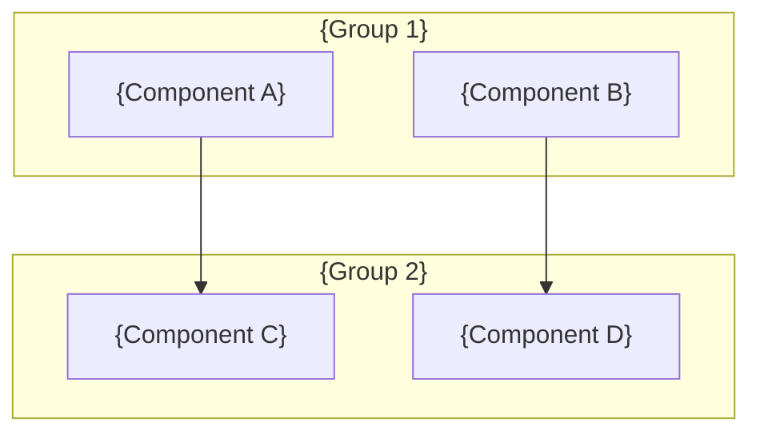
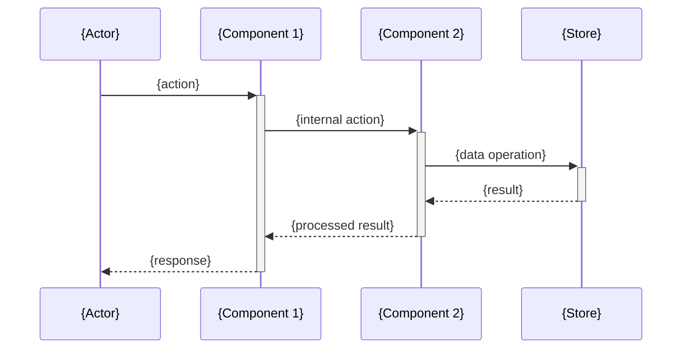
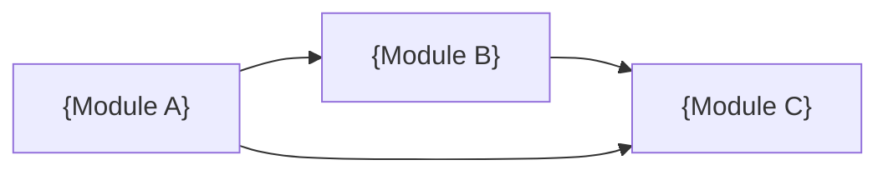

# Blueprint Output Template

Use this exact structure for the final `BLUEPRINT.md`. Fill in each section from agent findings. Remove sections marked "(if applicable)" when they don't apply, but add a brief note why.

---

```markdown
# Architectural Blueprint: {Repository Name}

> Generated on {date} | Scanned by Claude Code `/blueprint`

## Technology Stack

| Category | Technology |
|----------|-----------|
| Language(s) | {languages with versions if known} |
| Framework(s) | {web/app frameworks} |
| Package Manager | {npm/pip/cargo/etc.} |
| Build System | {build tool and config} |
| Database | {database(s) used, or "None"} |
| Testing | {test framework(s)} |
| CI/CD | {CI system, or "Not configured"} |
| Deployment | {deployment method} |

## System Overview

{2-3 paragraphs describing:
 - What this system does and who it's for
 - How it's organized at the highest level
 - The primary architectural style and why it fits}

## Directory Structure

```
{repo-name}/
├── {dir}/          # {purpose}
├── {dir}/          # {purpose}
│   ├── {subdir}/   # {purpose}
│   └── {subdir}/   # {purpose}
└── {dir}/          # {purpose}
```

{Brief notes on organization philosophy — e.g., "Feature-based grouping" or "Layer-based separation"}

## Component Map



### Component Details

#### {Component 1}
- **Location**: `{path}/`
- **Responsibility**: {what it does and why it exists}
- **Key files**: `{file1}`, `{file2}`
- **Depends on**: {other components}

{Repeat for each major component — aim for 4-8 components, not every directory}

## Data Flow



{Brief prose explaining the primary data flow — what triggers it and what the end result is}

## API Surface

### REST Endpoints (if applicable)

| Method | Path | Description |
|--------|------|-------------|
| {GET/POST/...} | {path} | {description} |

### CLI Commands (if applicable)

| Command | Description |
|---------|-------------|
| {command} | {description} |

{Include other API types as discovered: GraphQL, gRPC, WebSocket, Events, Library exports}

## Dependencies

### External

| Dependency | Category | Purpose |
|-----------|----------|---------|
| {name} | {Framework/DB/Auth/etc.} | {why it's used} |

### Internal Module Dependencies



{Note dependency direction and any circular dependencies}

## Architecture Patterns

- **Primary pattern**: {e.g., "Layered monorepo with hexagonal core"}
- **Key abstractions**: {list the 3-5 most important abstractions}
- **Error handling**: {approach — exceptions, Result types, etc.}
- **Testing strategy**: {how tests are organized and what levels exist}

## Architecture Assessment

{Brief fitness assessment — not a full review, but enough to help the reader understand whether the architecture is appropriate for the system's goals.}

- **Well-suited for**: {what this architecture handles well — e.g., "high-throughput async I/O", "independent team scaling", "rapid feature iteration"}
- **Potential friction**: {where the architecture may create challenges — e.g., "cross-service transactions", "shared state coordination", "deployment complexity"}
- **Evolution considerations**: {what would need to change if the system grows — e.g., "the monolith's service layer is already well-separated, making future extraction straightforward"}

## Key Design Decisions

1. **{Decision}** — {what was chosen, with rationale if known}
2. **{Decision}** — {what was chosen, with rationale if known}
{3-6 decisions that shape the architecture}

## Entry Points

| Entry Point | Type | Location | Description |
|------------|------|----------|-------------|
| {name} | {HTTP/CLI/Worker/Library} | `{file path}` | {what it starts} |
```
