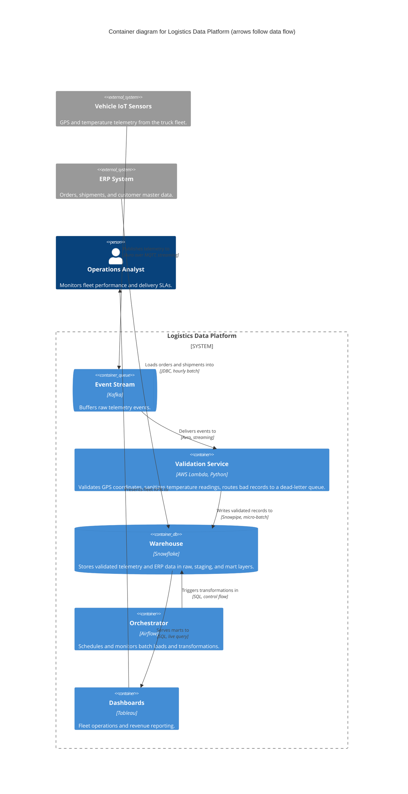

# C4 for data platforms and pipelines

C4 was designed for application software, but data systems suffer the exact problem it solves: many stages, many audiences, and diagrams that are either a jumble of boxes and arrows or dangerously oversimplified. The mapping below adapts each level to data work.

## Level mapping

| C4 level | Data platform reading | Typical elements |
|---|---|---|
| 1 — Context | Where data comes from, where it goes, who consumes it | Source systems (ERP, CRM, IoT sensors, SaaS, external APIs) as external systems; the platform as the one system in scope; consumers (analysts, executives, downstream apps, regulators/auditors) as people or external systems |
| 2 — Container | Where data lives and how it moves between deployables | Ingestion/streaming (Kafka, Kinesis), orchestrator (Airflow, Dagster), transformation jobs (dbt, Spark, Lambda), warehouse/lake (Snowflake, BigQuery, S3), BI/serving (Tableau, an API) |
| 3 — Component | Stages inside one job or pipeline container | Validators, sanitizers, enrichment steps, error/dead-letter handlers, sink writers |
| 4 — Code | Skip | Rarely worth hand-maintaining even for application software; for pipelines, essentially never |

## Data-specific conventions

- **Arrows follow the data.** Use data-flow direction as the arrow convention and state it in the diagram title or a note. Lineage then reads directly off the Container diagram: source → ingestion → transformation → warehouse → consumer.
- **Label data-movement arrows with format, protocol, and cadence.** `Avro over Kafka, streaming`, `CSV via SFTP, daily batch`, `SQL, hourly`. Format and cadence are where data-integration cost hides; an unlabeled arrow conceals exactly what the reader needs. Arrows to people (a dashboard presenting KPIs to an analyst) carry intent only.
- **The orchestrator is a container, not an arrow.** Airflow triggering a job is a control-flow relationship ("triggers, on schedule"); keep it visually distinct from data-flow arrows (style or explicit "control" label) or the lineage story breaks.
- **Datasets are not containers.** A warehouse is a container; the tables inside it are not components. If layer structure matters (raw/staging/marts, bronze/silver/gold), show layers as components of the warehouse container or as a boundary grouping — don't give every table a box.
- **Auditors are an audience.** Regulated data flows benefit from a Context diagram naming the regulator/auditor as a consumer, and from cadence labels showing when data moves.

## Worked example: Level 2 for a logistics data platform

At Level 3, the Validation Service opens up into components: GPS validator, temperature sanitizer, dead-letter handler, Snowpipe writer — which is what stops it from being a black box in incident reviews.

## Practical notes

- Most data teams get full value from Levels 1–2. Draw Level 3 for the one or two containers people keep asking about.
- Treat the diagrams as living documentation: update them in the same change that alters the pipeline, or they rot into fiction.
- Disagreement while drawing ("wait, does the ERP load go through Kafka?") is signal, not friction — it means the diagram is surfacing missing shared understanding. Resolve it against the deployed reality, not against memory.
