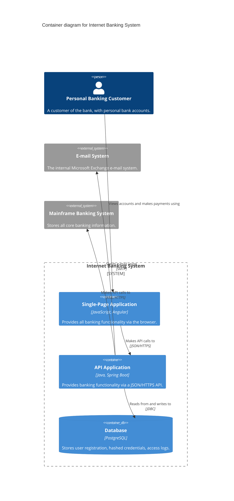
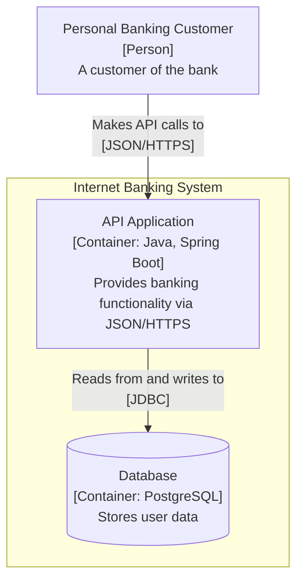

# Mermaid C4 syntax reference

Mermaid ships five C4 diagram types: `C4Context`, `C4Container`, `C4Component`, `C4Dynamic`, `C4Deployment`. The syntax mirrors C4-PlantUML. It is officially experimental — the grammar is strict and layout control is limited, so follow the shapes below exactly.

## General rules

- First line is the diagram type keyword; second line should be `title <text>`.
- All element macros take positional arguments: `alias` first (an identifier, no quotes), then quoted strings.
- Commas inside quoted strings are fine; unquoted commas break parsing. Quote every string argument.
- Aliases must be unique across the diagram and are what `Rel` refers to.
- Trailing arguments are optional — `Container(api, "API")` is legal — but this skill's notation rules require description always and technology for containers/components.

## Elements

```
Person(alias, "Label", "Description")
Person_Ext(alias, "Label", "Description")

System(alias, "Label", "Description")
System_Ext(alias, "Label", "Description")
SystemDb(alias, "Label", "Description")          %% database as a system
SystemQueue(alias, "Label", "Description")       %% message bus as a system
SystemDb_Ext(...) / SystemQueue_Ext(...)

Container(alias, "Label", "Technology", "Description")
Container_Ext(alias, "Label", "Technology", "Description")
ContainerDb(alias, "Label", "Technology", "Description")
ContainerQueue(alias, "Label", "Technology", "Description")
ContainerDb_Ext(...) / ContainerQueue_Ext(...)

Component(alias, "Label", "Technology", "Description")
Component_Ext(...) / ComponentDb(...) / ComponentQueue(...)
```

`_Ext` variants render grey and mark elements outside your team's ownership.

## Boundaries

```
Enterprise_Boundary(alias, "Label") {
    ...elements...
}
System_Boundary(alias, "Label") {
    ...containers...
}
Container_Boundary(alias, "Label") {
    ...components...
}
Boundary(alias, "Label", "type") {
    ...
}
```

A Container diagram wraps the in-scope system's containers in a `System_Boundary`; people and external systems sit outside it. A Component diagram wraps components in a `Container_Boundary`.

There is no landscape diagram keyword — draw a system landscape as `C4Context` with an `Enterprise_Boundary` around the systems the enterprise owns.

## Relationships

```
Rel(from, to, "Label")
Rel(from, to, "Label", "Technology/Protocol")
BiRel(from, to, "Label", "Technology")           %% avoid; prefer two Rel lines
Rel_U / Rel_D / Rel_L / Rel_R(from, to, "Label", "Technology")   %% layout hints
```

`Rel_U/D/L/R` nudge the arrow direction and are the main layout lever when auto-layout tangles.

## Dynamic and deployment extras

```
C4Dynamic
    ...elements/boundaries...
    RelIndex(1, a, b, "First this happens")
    RelIndex(2, b, c, "Then this", "JSON/HTTPS")
```

Mermaid ignores `RelIndex`'s index argument — sequence numbers come from the order the statements are written, so write them in scenario order and keep the index arguments matching that order for readability.

```
C4Deployment
    Deployment_Node(alias, "Label", "Type", "Description") {
        Container(...)
        Deployment_Node(nested, "Label", "Type") {
            ...
        }
    }
```

## Styling and layout

```
UpdateElementStyle(alias, $bgColor="...", $fontColor="...", $borderColor="...")
UpdateRelStyle(from, to, $textColor="...", $lineColor="...", $offsetX="-40", $offsetY="10")
UpdateLayoutConfig($c4ShapeInRow="3", $c4BoundaryInRow="1")
```

`UpdateLayoutConfig` is the most useful: `$c4ShapeInRow` caps elements per row (default 4), `$c4BoundaryInRow` caps boundaries per row. Set `$c4ShapeInRow="3"` for diagrams with long labels. `UpdateRelStyle` offsets fix relationship labels that land on top of lines.

## Complete example (Container diagram)



## Rendering check

Validate each diagram if mermaid-cli is available. Write the diagram source to a file with the file-write tool or a quoted heredoc (diagram text contains apostrophes, so don't pass it through single-quoted `echo`):

```bash
cat > /tmp/c4.mmd <<'EOF'
<diagram source>
EOF
command -v mmdc >/dev/null && mmdc -i /tmp/c4.mmd -o /tmp/c4.svg \
  || npx -y @mermaid-js/mermaid-cli -i /tmp/c4.mmd -o /tmp/c4.svg
```

The npx fallback downloads mermaid-cli and headless Chromium — skip it in offline or sandboxed environments and validate by review instead. A non-zero exit means a parse error; the message points at the offending line.

## Fallback: flowchart with C4 notation

When C4 auto-layout stays unreadable (typically >10 elements or deep nesting), switch to a plain flowchart and carry the notation in the text:



Element type and technology go in square brackets on the second line; protocol goes in brackets on the edge label. All review-checklist rules still apply.
