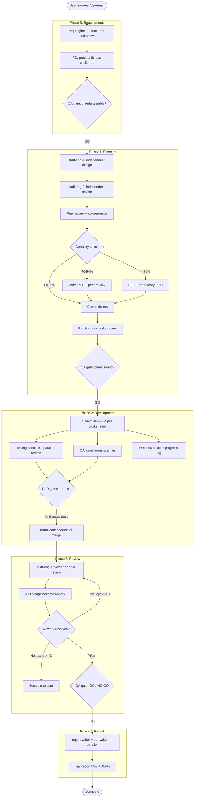
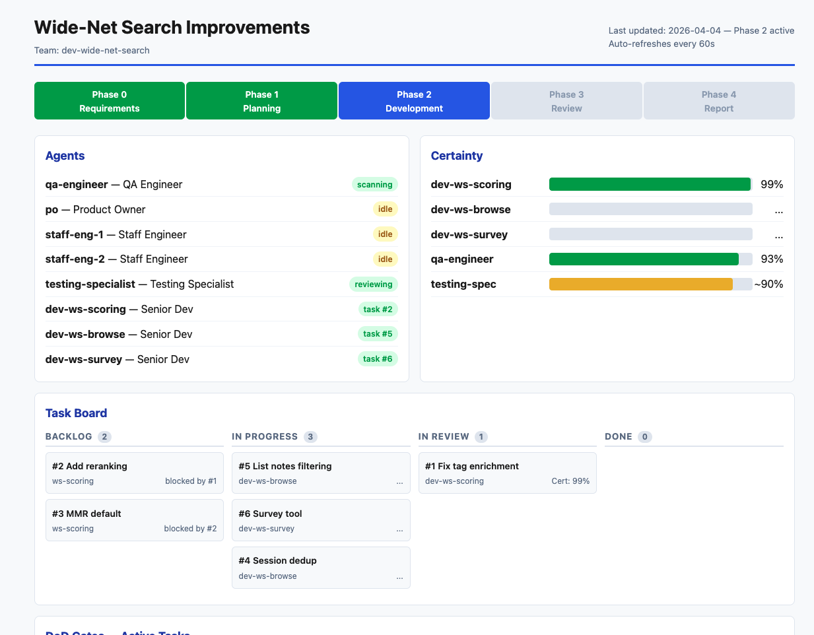

# /dev-team

A Claude Code skill that orchestrates a multi-agent software development team. It spawns specialized agents (requirements engineer, staff engineers, senior developers, QA, product owner, testing specialist) that work in parallel across isolated git worktrees to deliver complex features with full traceability.

## Recommended Workflow

The best results come from front-loading planning **before** invoking `/dev-team`:

1. **Draft a plan interactively with Claude.** Describe the feature or bug in conversation. Go back and forth until the approach is clear -- scope, key design decisions, files involved, testing strategy.

2. **Ask Claude to self-assess certainty.** Prompt: *"Rate your confidence on each part of this plan from 0-100% and explain what's uncertain."* This surfaces weak spots before they become rework cycles inside the dev team.

3. **Iterate on low-certainty areas.** Research unknowns, write POCs, or narrow scope until all sections are >=90%. The dev team's Phase 1 (Planning) will still run its own independent design, but starting from a high-certainty plan dramatically reduces rework.

4. **Invoke `/dev-team` with the plan.** Paste or reference the plan. The skill takes it from there: requirements formalization, independent SE design, parallel development, adversarial review, and final report.

```
/dev-team
```

## Workflow



## Live Dashboard

The team lead maintains a live HTML dashboard at `.dev-team-artifacts/{team-name}/dashboard.html`. It shows:

- **Phase progress bar** (0-4) with color-coded status
- **Agent roster** with live status badges (active, idle, scanning, reviewing)
- **Certainty heatmap** per workstream (red <80%, yellow 80-94%, green >=95%)
- **Kanban task board** (Backlog, In Progress, In Review, Done) with dependency tracking
- **DoD gate tracker** per task (5 gates)
- **Blockers and rework** section
- **Event timeline**

The dashboard HTML includes a `<meta http-equiv="refresh">` tag, but that only refreshes the browser view -- the team lead must regenerate the file. Agents are unreliable at self-polling, so the skill uses hooks as a safety net. Three mechanisms nudge the team lead to keep the dashboard fresh:

1. **Active polling instructions**: the skill text tells the team lead to regenerate the dashboard every few messages (~60-120s of wall-clock time)
2. **PostToolUse hooks**: fire after every `SendMessage`, `TaskUpdate`, `TaskCreate`, and `Agent` tool call. If the dashboard file is >2 minutes old, the hook injects a `systemMessage` telling the team lead to regenerate immediately
3. **Stop hooks**: the same check fires at the end of every Claude turn -- the closest thing to a timer, catching stale dashboards even between tool calls

Every status update to the user also includes the dashboard path as a clickable link.



## Final Report

Every run produces a self-contained HTML report at `.dev-team-artifacts/{team-name}/reports/final-report.html` with:

- Executive summary with acceptance criteria scorecard
- Stats grid (criteria met, tasks completed, tests written, files changed)
- Per-workstream implementation details (files modified, tickets completed, key decisions)
- All RFCs embedded (full text, collapsible)
- All POC results (code snippets + outcomes)
- All research notes
- All ADRs (full text, collapsible)
- Design decisions with rationale and alternatives considered
- Test results and coverage


## Phases

### Phase 0: Requirements

**Agent**: `req-engineer`

- Conducts structured interview (scope, acceptance criteria, verification strategy, interfaces, NFRs)
- Produces requirements document with numbered acceptance criteria (AC-001, AC-002, ...)
- PO conducts "product fitness challenge" -- could we build something better?
- **QA gate**: criteria must be testable, verification strategy defined

### Phase 1: Planning

**Agents**: `staff-eng-1`, `staff-eng-2` (independent design, then peer review)

- Two staff engineers design independently (neither sees the other's work)
- Risk-driven approach:
  - >=95% certainty: create ticket directly
  - 70-94% certainty: write RFC, peer review to converge
  - <70% certainty: RFC + mandatory proof-of-concept
- Peer review convergence (both must reach >=95%)
- Backlog partitioned into orthogonal workstreams
- **QA gate**: RFCs sound, test plans present, certainty justified

**Artifacts**: RFCs (`rfcs/{number}-{topic}.md`), POCs (`pocs/{number}-{topic}/`)

### Phase 2: Development

**Agents**: one `dev-{workstream}` per workstream (worktree isolation), plus `testing-specialist`, `qa-engineer`, `po`

- Each developer works in an isolated git worktree
- Testing specialist reviews tests **in parallel** with development (not after)
- QA runs as continuous scanner, reading code directly from worktrees
- PO maintains append-only progress log and manages task board
- **Definition of Ready**: dependencies resolved, RFC approved, acceptance criteria clear
- **Task contracts**: dev proposes 3-5 test criteria before implementation
- **Definition of Done** (5 gates): code complete, tests pass, peer review, testing specialist sign-off, QA GO
- **Rework loop**: issue found -> rework ticket -> fix -> original reviewer re-verifies -> sign-off

### Phase 3: Review

**Agents**: `qa-engineer` (lead), `staff-eng-adversarial` (fresh eyes, no prior context)

- Adversarial reviewer has **zero prior context** (intentional blind-spot prevention)
- ALL findings (Critical, Major, Minor) become rework tickets -- no triaging away
- QA produces formal phase gate assessment (GO / NO-GO)
- Max 3 rework cycles, then escalate to user

### Phase 4: Report

**Agents**: `report-writer`, `adr-writer` (spawned in parallel)

- Self-contained HTML report with all artifacts embedded
- Numbered ADRs for every significant design decision
- **Phase 4 is sacred** -- always runs, never skipped

## Agent Roles

| Role | Agent ID | Lifecycle | Purpose |
|------|----------|-----------|---------|
| Requirements Engineer | `req-engineer` | Phase 0 | Structured requirements gathering |
| Staff Engineer | `staff-eng-1`, `staff-eng-2` | Phase 1, escalations | Independent design, RFCs, POCs |
| Product Owner | `po` | Phases 0-4 | Task management, progress log, prioritization |
| QA Engineer | `qa-engineer` | Phases 0-4 | Continuous scanner, phase gate assessments |
| Senior Developer | `dev-{workstream}` | Phase 2-3 | Implementation in isolated worktrees |
| Testing Specialist | `testing-specialist` | Phase 2-3 | Parallel test review, sign-off |
| Adversarial Reviewer | `staff-eng-adversarial` | Phase 3 | Cold review with no prior context |
| Report Writer | `report-writer` | Phase 4 | Self-contained HTML report |
| ADR Writer | `adr-writer` | Phase 4 | Architecture decision records |

## Workstream Management

Tasks are partitioned into **orthogonal workstreams** for maximum parallelism:

- **File-level orthogonality**: workstreams touch different files/directories
- **Interface-level orthogonality**: contracts (protocols, types) defined upfront
- **Primary workstream**: one workstream owns all shared files (pyproject.toml, config, CI/CD, shared types)
- **Merge strategy**: dependencies first, primary last, full test suite after each merge

Cross-workstream dependencies are tracked with `addBlockedBy`/`addBlocks` on tasks. Blocking work is prioritized.

## Certainty Protocol

Every decision requires a certainty level (0-100%):

- **>=95%**: proceed (the universal gate for all phase transitions)
- **70-94%**: write RFC, peer review to converge
- **<70%**: RFC + mandatory POC
- Certainty claims require evidence (test results, code analysis)
- Max 80% certainty without tests; >=95% requires test evidence

## Sacred Rules (never skip)

1. **QA phase gates** at every transition
2. **Phase 4** (report) always runs
3. **Test coverage** for every code path
4. **Testing specialist** spawned at Phase 2 start
5. **PO** always spawned
6. **All adversarial findings** become rework tickets

## Artifact Directory Structure

```
.dev-team-artifacts/{team-name}/
├── requirements/
│   └── requirements.md          # Numbered acceptance criteria
├── rfcs/
│   ├── 001-topic.md             # Risk-driven design documents
│   └── 002-topic.md
├── pocs/
│   └── 001-topic/               # Proof-of-concept code + results
├── research/
│   └── {findings}.md            # Investigation notes
├── adrs/
│   ├── 001-topic.md             # Architecture decision records
│   └── 002-topic.md
├── reports/
│   └── final-report.html        # Self-contained HTML report
├── dashboard.html               # Live auto-refreshing dashboard
└── progress.md                  # Append-only progress log (PO)
```

## Templates

The skill includes templates for all artifacts (in `references/templates.md`):

- **Requirements document**: context, scope, user stories, acceptance criteria table, verification strategy, NFRs
- **RFC**: status, problem statement, proposed solution, alternatives, risk assessment, required tests, review comments
- **Task/ticket**: workstream-prefixed subject, acceptance criteria, dependencies, DoR/DoD checklists, certainty
- **ADR**: context, decision, consequences, alternatives considered, source artifacts
- **Final report HTML**: inline CSS, stat grid, collapsible sections, requirements status table
- **Dashboard HTML**: phase bar, agent roster, Kanban board, DoD gates, certainty heatmap, timeline

## Skill Files

```
.claude/skills/dev-team/
├── SKILL.md                         # Main orchestration logic (hooks inlined in frontmatter)
├── references/
│   ├── roles.md                     # Agent role definitions
│   ├── templates.md                 # Document templates
│   └── workstream-management.md     # Workstream partitioning rules
├── scripts/
│   └── check-dashboard.sh           # Standalone diagnostic for manual testing
└── assets/
    └── dashboard.png                # Dashboard screenshot
```
